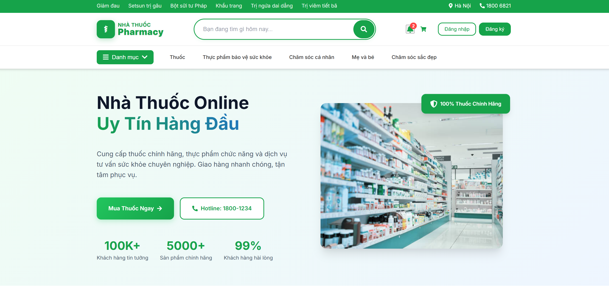
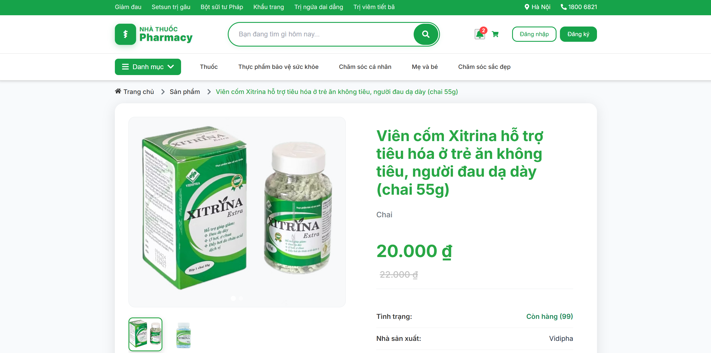
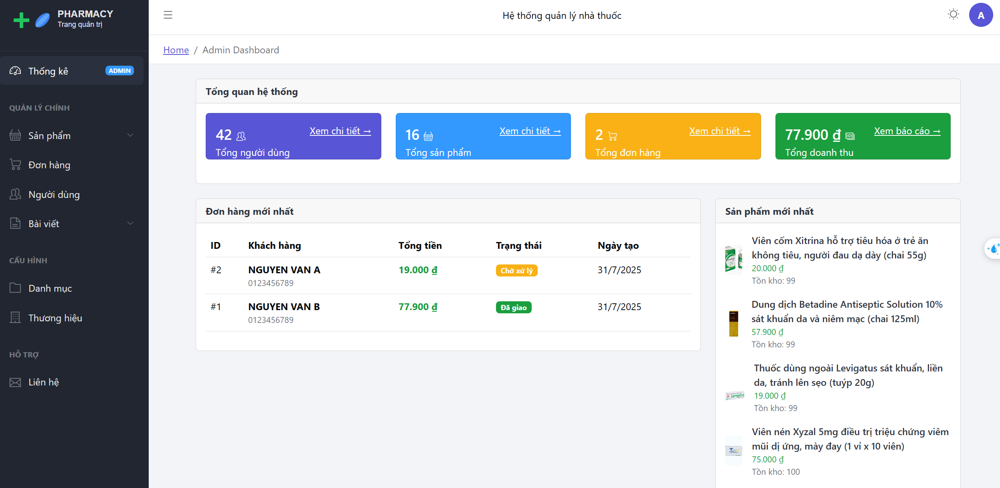
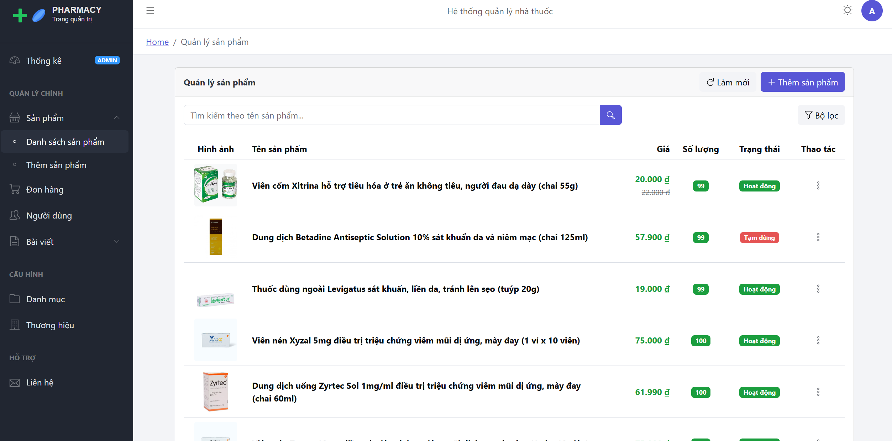
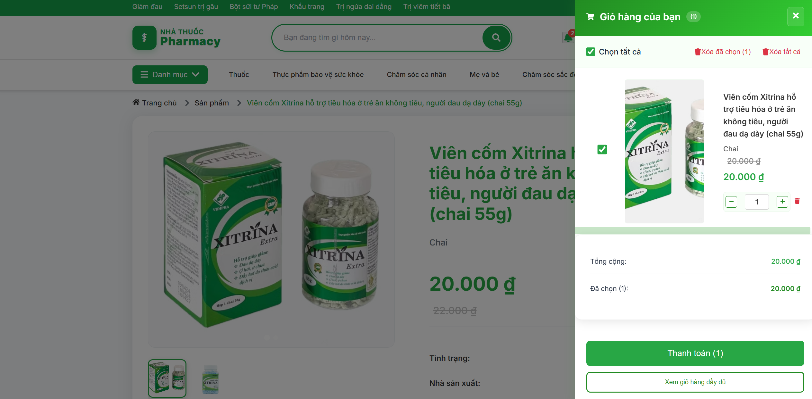
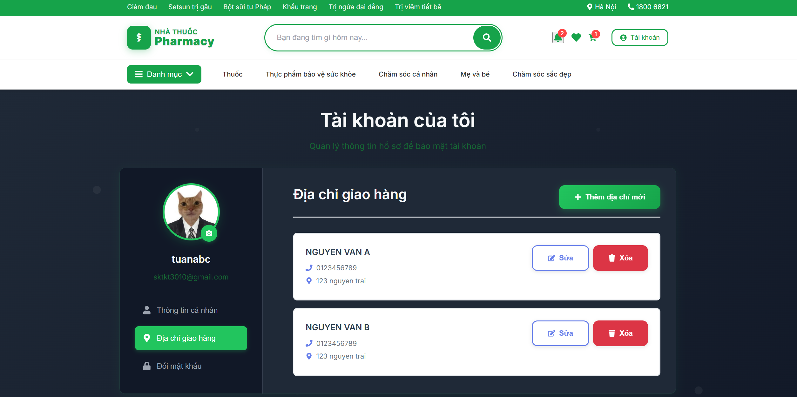
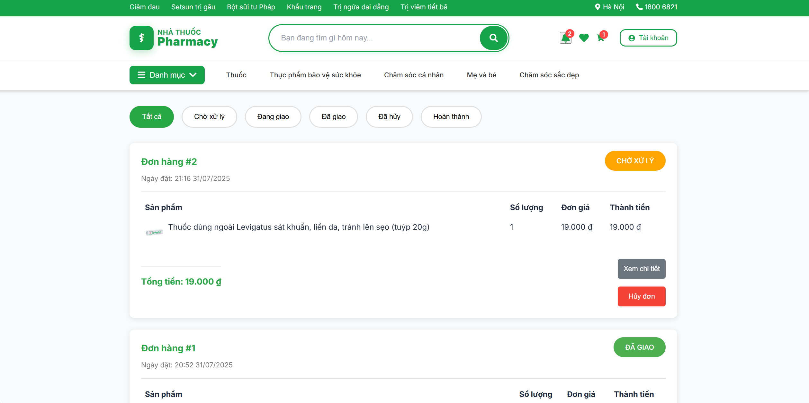
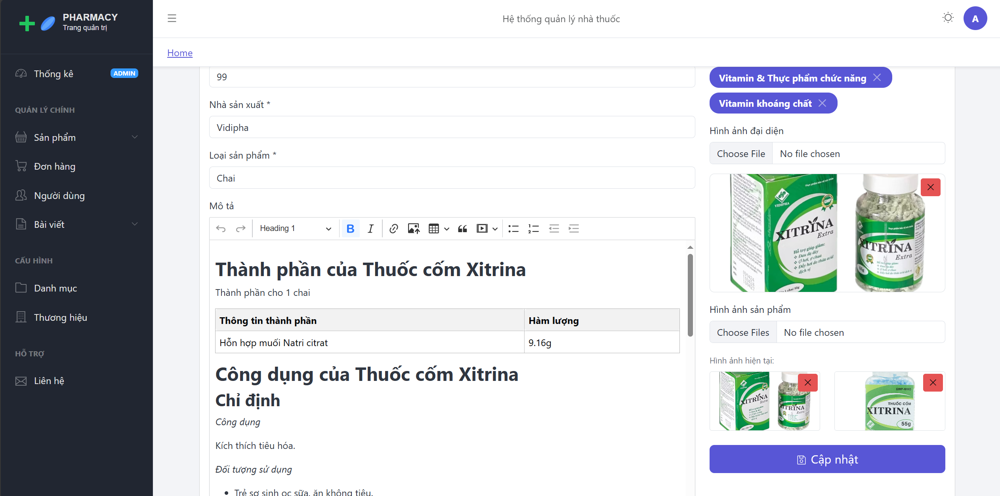
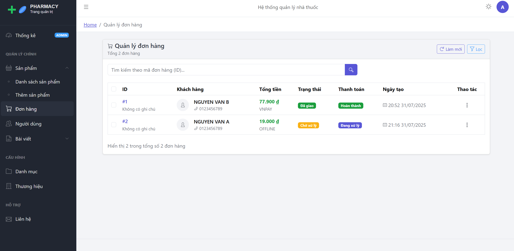
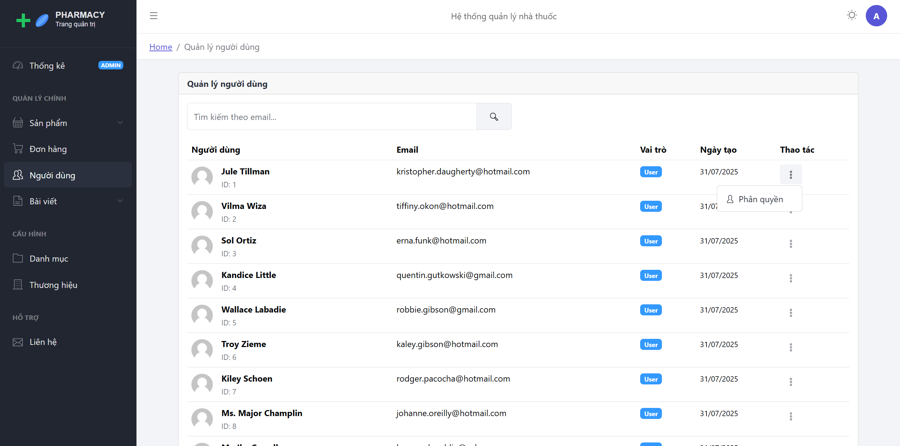

# 🏥 Pharmacy Ecomerce System

A comprehensive pharmacy management system with user and admin interfaces, built with Spring Boot, React, and MySQL.


## 📋 Table of Contents

- [Screenshots](#-screenshots)
- [Overview](#-overview)
- [Key Features](#-key-features)
- [System Architecture](#-system-architecture)
- [Technologies Used](#-technologies-used)
- [Installation & Setup](#-installation--setup)
- [API Documentation](#-api-documentation)
- [Project Structure](#-project-structure)
- [Contributing](#-contributing)
- [Contact](#-contact)

## 📱 Screenshots

### 🌟 Live Application Preview

#### 🛒 Customer E-commerce Interface


*Modern e-commerce platform with intuitive product browsing and seamless shopping experience*

#### 👨‍💼 Admin Management Dashboard  


*Comprehensive admin panel with real-time analytics and complete inventory management*

---

> **✨ The application features a modern, professional design with intuitive navigation and responsive layout**

## 🎯 Overview

Pharmacy Management System is a full-stack web application designed to efficiently manage pharmacy operations. The system provides three main components:

- **Frontend User**: E-commerce interface for customers
- **Frontend Admin**: Management dashboard for staff and administrators
- **Backend API**: RESTful API built with Spring Boot

## ✨ Key Features

### 🛒 Customer Features (Frontend User)
- **Authentication & Authorization**: Registration, login, forgot password
- **Product Management**: Browse, search, filter products by category/brand
- **Shopping Cart**: Add/remove/update products, calculate totals
- **Wishlist**: Save favorite products
- **Order Management**: Create orders, track order status
- **Payment**: VNPay integration
- **Profile Management**: Multiple delivery addresses
- **Blog**: Health and medical articles

### 👨‍💼 Admin Features (Frontend Admin)
- **Dashboard**: Revenue, orders, and product statistics
- **Product Management**: CRUD operations, image upload
- **Category Management**: Parent-child category organization
- **Brand Management**: Complete brand CRUD operations
- **Order Management**: View and update order status
- **User Management**: Role assignment (ADMIN/STAFF/USER)
- **Blog Management**: Create and edit articles
- **Contact**: Handle customer inquiries

### 🔧 Backend API Features
- **RESTful API**: REST-compliant design
- **JWT Authentication**: Secure token-based authentication
- **Role-based Authorization**: Permission control by user roles
- **File Upload**: Image upload and management
- **Email Service**: Authentication and notification emails
- **Payment Integration**: VNPay payment gateway integration

## 🏗️ System Architecture

```
┌─────────────────┐    ┌─────────────────┐    ┌─────────────────┐
│                 │    │                 │    │                 │
│  Frontend User  │    │ Frontend Admin  │    │   Backend API   │
│   (React)       │    │   (React)       │    │ (Spring Boot)   │
│                 │    │                 │    │                 │
└─────────┬───────┘    └─────────┬───────┘    └─────────┬───────┘
          │                      │                      │
          │            API Calls │                      │
          └──────────────────────┼──────────────────────┘
                                 │
                    ┌────────────┴─────────────┐
                    │                          │
                    │       MySQL Database     │
                    │                          │
                    └──────────────────────────┘
```

## 🛠️ Technologies Used

### Backend
- **Java 21** - Primary programming language
- **Spring Boot 3.5.0** - Main framework
- **Spring Security** - Security and authentication
- **Spring Data JPA** - ORM and database queries
- **MySQL** - Database management system
- **JWT** - JSON Web Token for authentication
- **MapStruct** - Entity/DTO mapping
- **Docker** - Containerization
- **Maven** - Build tool

### Frontend User
- **React 18.2.0** - UI library
- **React Router DOM** - Client-side routing
- **Axios** - HTTP client
- **React Hook Form** - Form handling
- **React Icons** - Icon library
- **React Toastify** - Notifications
- **Styled Components** - CSS-in-JS styling

### Frontend Admin
- **React 18.2.0** - UI library
- **CoreUI** - Admin dashboard framework
- **Vite** - Build tool and dev server
- **Chart.js** - Charts and statistics
- **CKEditor** - Rich text editor
- **Axios** - HTTP client

## 🚀 Installation & Setup

### System Requirements
- Java 21 or higher
- Node.js 16+ and npm
- MySQL 8.0+
- Docker (optional)

> **📁 Database**: Complete database with sample data is provided in `backend/db/pharmacy.sql`

### 1. Clone Repository
```bash
git clone https://github.com/glmj10/pharmacy.git
cd pharmacy
```

### 2. Backend Setup

#### Option 1: Run Directly
```bash
cd backend

# Create and import database
mysql -u root -p
CREATE DATABASE pharmacy;
USE pharmacy;
SOURCE db/pharmacy.sql;
EXIT;

# Or import using command line
mysql -u root -p pharmacy < db/pharmacy.sql

# Copy configuration file
cp sample.env .env
# Edit database information in .env

# Run application
./mvnw spring-boot:run
```

#### Option 2: Using Docker
```bash
cd backend
docker-compose up --build
```

Backend will run at: http://localhost:8080

### 3. Frontend User Setup
```bash
cd frontend-user

# Install dependencies
npm install

# Copy configuration file
cp sample.env .env
# Edit API URL and PORT in .env
# PORT=3001
# REACT_APP_API_URL=http://localhost:8080/api/v1

# Run application
npm start
```

Frontend User will run at: http://localhost:3001

### 4. Frontend Admin Setup
```bash
cd frontend-admin

# Install dependencies
npm install

# Copy configuration file
cp sample.env .env
# Edit API URL in .env

# Run application
npm start
```

Frontend Admin will run at: http://localhost:3000

### 5. Full System Setup

#### Complete Installation
```bash
# Clone repository
git clone https://github.com/lmao1166/pharmacy.git
cd pharmacy

# Setup Backend
cd backend
# Create and import database
mysql -u root -p
CREATE DATABASE pharmacy;
USE pharmacy;
SOURCE db/pharmacy.sql;
EXIT;

cp sample.env .env
# Edit database configuration in .env
./mvnw spring-boot:run &

# Setup Frontend User
cd ../frontend-user
npm install
cp sample.env .env
# Edit API URL in .env
npm start &

# Setup Frontend Admin
cd ../frontend-admin
npm install
cp sample.env .env
# Edit API URL in .env
npm start &
```

#### Access Applications
- **Backend API**: http://localhost:8080
- **Frontend User**: http://localhost:3001
- **Frontend Admin**: http://localhost:3000/admin

## 📚 API Documentation

### Authentication Endpoints
```
POST /api/v1/auth/register     - Register new account
POST /api/v1/auth/login        - User login
POST /api/v1/auth/logout       - User logout
POST /api/v1/auth/refresh-token - Refresh JWT token
PUT  /api/v1/auth/password     - Change password
POST /api/v1/auth/forgot-password - Forgot password
PUT  /api/v1/auth/reset-password  - Reset password
```

### Product Endpoints
```
GET    /api/v1/products              - Get product list
GET    /api/v1/products/{id}         - Get product by ID
GET    /api/v1/products/slug/{slug}  - Get product by slug
POST   /api/v1/products              - Create new product (ADMIN/STAFF)
PUT    /api/v1/products/{id}         - Update product (ADMIN/STAFF)
DELETE /api/v1/products/{id}         - Delete product (ADMIN/STAFF)
```

### Order Endpoints
```
GET  /api/v1/orders           - Get order list
POST /api/v1/orders           - Create new order (USER)
PUT  /api/v1/orders/{id}      - Update order (ADMIN/STAFF)
GET  /api/v1/orders/user/{id} - Get user orders (USER)
```

### Cart & Wishlist Endpoints
```
GET    /api/v1/carts              - Get shopping cart
POST   /api/v1/carts/item         - Add product to cart
PUT    /api/v1/carts/item/{id}    - Update quantity
DELETE /api/v1/carts/item/{id}    - Remove from cart

GET    /api/v1/wishlist           - Get wishlist
POST   /api/v1/wishlist           - Add to wishlist
DELETE /api/v1/wishlist/{id}      - Remove from wishlist
```

## �️ Detailed Interface Gallery

### 🛒 Customer Interface (Frontend User)

#### Homepage & Product Catalog

*Modern and intuitive homepage with featured products, categories, and search functionality*

#### Product Details & Shopping Cart


*Detailed product information with images, specifications, and seamless cart management*

#### User Dashboard & Order Tracking


*Personal dashboard with order history, profile management, and delivery tracking*

### 👨‍💼 Admin Interface (Frontend Admin)

#### Admin Dashboard & Analytics

*Comprehensive dashboard with sales analytics, revenue charts, and key performance indicators*

#### Product Management System


*Advanced product management with bulk operations, image upload, and inventory tracking*

#### Order Management & Customer Service


*Complete order processing system with status updates and customer management tools*

---

> **Note**: Screenshots showcase the actual application interface. The system features a modern, clean design with intuitive navigation and professional UI components.

## 📁 Project Structure

```
pharmacy-management-system/
├── backend/                    # Spring Boot API
│   ├── src/main/java/com/pharmacy/backend/
│   │   ├── controller/        # REST Controllers
│   │   ├── service/           # Business Logic
│   │   ├── repository/        # Data Access Layer
│   │   ├── entity/            # JPA Entities
│   │   ├── dto/               # Data Transfer Objects
│   │   ├── config/            # Configuration Classes
│   │   └── utils/             # Utility Classes
│   ├── src/main/resources/
│   │   ├── application.yml    # App Configuration
│   │   └── data.sql          # Initial Data
│   └── pom.xml               # Maven Dependencies
│
├── frontend-user/             # React User Interface
│   ├── src/
│   │   ├── components/       # Reusable Components
│   │   ├── pages/            # Page Components
│   │   ├── services/         # API Services
│   │   ├── contexts/         # React Contexts
│   │   ├── hooks/            # Custom Hooks
│   │   └── utils/            # Utility Functions
│   └── package.json          # Dependencies
│
├── frontend-admin/            # React Admin Interface
│   ├── src/
│   │   ├── views/            # Page Views
│   │   ├── components/       # UI Components
│   │   ├── services/         # API Services
│   │   ├── config/           # Configuration
│   │   └── utils/            # Helper Functions
│   └── package.json          # Dependencies
│
└── README.md                 # Project Documentation
```

## 🐳 Backend Docker Deployment

### Using Docker for Backend Only
```bash
cd backend

# Run backend with database using Docker Compose
docker-compose up --build

# Run in background
docker-compose up -d --build

# View logs
docker-compose logs -f

# Stop services
docker-compose down
```

### Production Deployment
```bash
# Production build with optimizations
docker-compose -f docker-compose.prod.yml up --build -d

# Monitor container health
docker-compose ps
docker stats
```

### Database Management
```bash
# Import initial database (from provided SQL file)
docker-compose exec -T mysql mysql -u root -p pharmacy < db/pharmacy.sql

# Backup database
docker-compose exec mysql mysqldump -u root -p pharmacy > backup.sql

# Restore database from backup
docker-compose exec -T mysql mysql -u root -p pharmacy < backup.sql

# Access database directly
docker-compose exec mysql mysql -u root -p pharmacy
```

## 🤝 Contributing

We welcome all contributions! To contribute:

1. Fork the repository
2. Create a feature branch (`git checkout -b feature/AmazingFeature`)
3. Commit your changes (`git commit -m 'Add some AmazingFeature'`)
4. Push to the branch (`git push origin feature/AmazingFeature`)
5. Open a Pull Request

## 📧 Contact

**Author**: tuannguyen30
- Email: tuantt3010@gmail.com
- LinkedIn: [\[Your LinkedIn Profile\]](https://www.linkedin.com/in/tu%E1%BA%A5n-nguy%E1%BB%85n-h%E1%BB%AFu-0b742132b/)
- GitHub: [\[Your GitHub Profile\]](https://github.com/glmj10)

**Project Link**: [https://github.com/yourusername/pharmacy-management-system](https://github.com/yourusername/pharmacy-management-system)

---

⭐ If you find this project helpful, please give us a star on GitHub!

## 🔄 Changelog

### Version 1.0.0 (Current)
- ✅ Complete authentication and authorization system
- ✅ Product, category, and brand management
- ✅ Shopping cart and wishlist functionality
- ✅ Order management and payment system
- ✅ Admin dashboard with statistics
- ✅ VNPay payment gateway integration
- ✅ Responsive design for mobile devices

### Development Roadmap
- 🔄 Add chat support feature
- 🔄 Integrate additional payment methods
- 🔄 Advanced reporting system
- 🔄 Progressive Web App (PWA) support
- 🔄 Multi-language support
